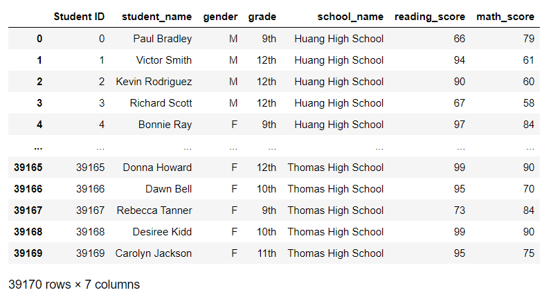

## Project: School_District_Analysis
Working with Anaconda, Jupyter Notebook, Python and Pandas to analyze data for a school district.

### Overview of the school district analysis
This challenge invovled working with the school district to create a program that could efficiently interpret a large dataset of high school students in one school district and display easy-to-read tables that show the student scores within certain grades and schools.  Here are list of required deliverables from the district:
- Provide a snapshot of the district's key metrics presented in table format
- Provide an overview of the key metrics for each school in table format
- List the top five and bottom five performing schools based on the overall passing rate
- Caculate the average math and reading scores by students in each grade level
- List school performance based on budget per student, school size and type of high school.

Three other deliverables have been taken into account:
1: Replace one school's ninth-grade reading and math scores
2: Repeat the school district analysis to check for errors and fraud
3: A written report for the school district analysis

### Summary of data analysis

By conducting this analysis, the school district can effectively determine their next steps in terms of funding per student capita, per school, and even per grade based on the results provided.  The data shown will allow also coduct a comparison of the student success percentages on reading versus math, the passing percentages and the overall percentages of passing students.  I've also created grouping of student scores by the school spending, the school size and the type of school.

There has also been a suspicion of fraud in editing the student test results.  With the program provided, I have been able to create a table of information, clear the values out and re-replace those values with the same data set to ensure there is no mishandling errors or any fradulent activity in determining these metrics.  As an example, there was a concerted effort to focus on the results by Thomas High School.  To prove this, I've edited the code to remove all of the reading and math scores for the entire ninth-grade in Thomas High as a case study.  The program will show that there is no ill-intent, no evidence of fraud or suspicious activity.

In fact, with this program, there is built-in automation to read any comma-delimited (.CSV) dataset with the same formatted columns.  Simply change the name of the file and the analysis can be determined in the same manner.  Different types of datasets can also be read, by tweaking and refactoring the code to gain the same benefits.  As long as the source of the data can be verified, then the data will be accurately depicted here.

This program was written to automate and calculate the passing percentages of a dataset for this entire school district and, for that matter, can be utilized for many school districts in a very efficient manner.  It will also help in determining the total budgetary amounts per capita, per grade, per school if those metrics are analytics are necessary data points.

With the work conducted by this program the district is able to take a deeper dive into analyzing the ninth-grade scores for Thomas High School, for example.   The case study was to replace their ninth-grade scores which may further provide information on how the other students scores are affected in passing percentages.

#### As an example of some of the data uncovered by this program, I've taken a snip of the Math Versus Reading Scores Per Grade:

#### Next is the Scores by School Spending and School Size:

#### Lastly, this dataframe shows the Scores by School Type:

### Summary
To depict the non-evidence of fraud, four changes were made to our case study school - Thomas High.  First I removed isolated all of the ninth grade students.  Then erased all of their reading and math scores to zero.  Then I repeated the school analysis, made sure the data was clean, then recalculated the percentages found and added those percentages to the dataframes.  Without just displaying those calculations, a variable was created to ensure the right values were inputed into the table without user intervention.  The findings were exactly the same as the original values in the initial dataset, so that proves that there was no fraud involved with this dataset.

Since this group of ninth-graders was isolated from the rest of the dataset, I went ahead and compared their passing percentages, the number of students that passed both reading and math as well as obtained their overall passing percentage.

The tools used in this challenge were Anaconda, Jupyter Notebook, Python and Pandas.  It was great to utilize the functionality of all the tools combined to create a user-friendly program that effortlessly depicts such important data.  As mentioned before the reading and the interpretation of the data is flexible with this customized program.  If new data can be provided in the same format this script can easy read, merge, format and output clear statistical findings that can add to key decision making.  Refactoring this code should be just as simple with the right tools and minor manipulation.

In summary the data depicted here is quite interesting.  Prior to this work, my assumption was that the more you spend on a child the harder they work to succeed, as the school has been given more funds per student to appropriate the right tools and better technology to get better grades.  My assumptions were incorrect.  As you can see here, the students with the best grades were given the smaller funding amounts and attended the medium-sized charter high schools.  This is a peek at one school district, however it would be interesting to see how the rest of the school districts would size up next to this one.
